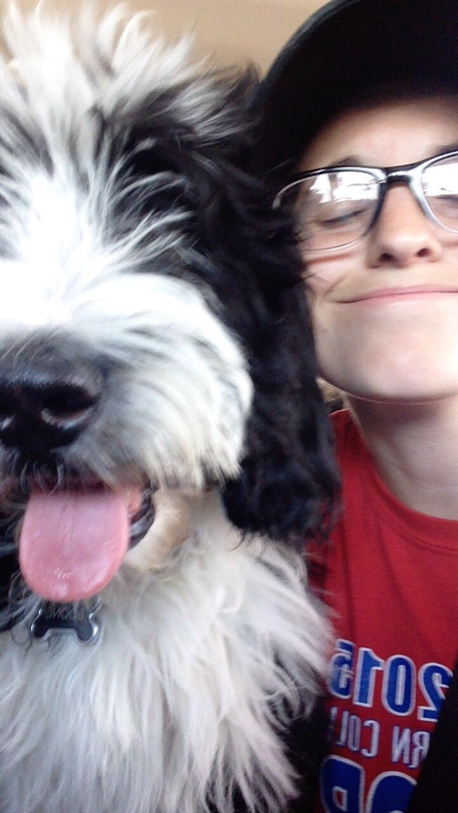
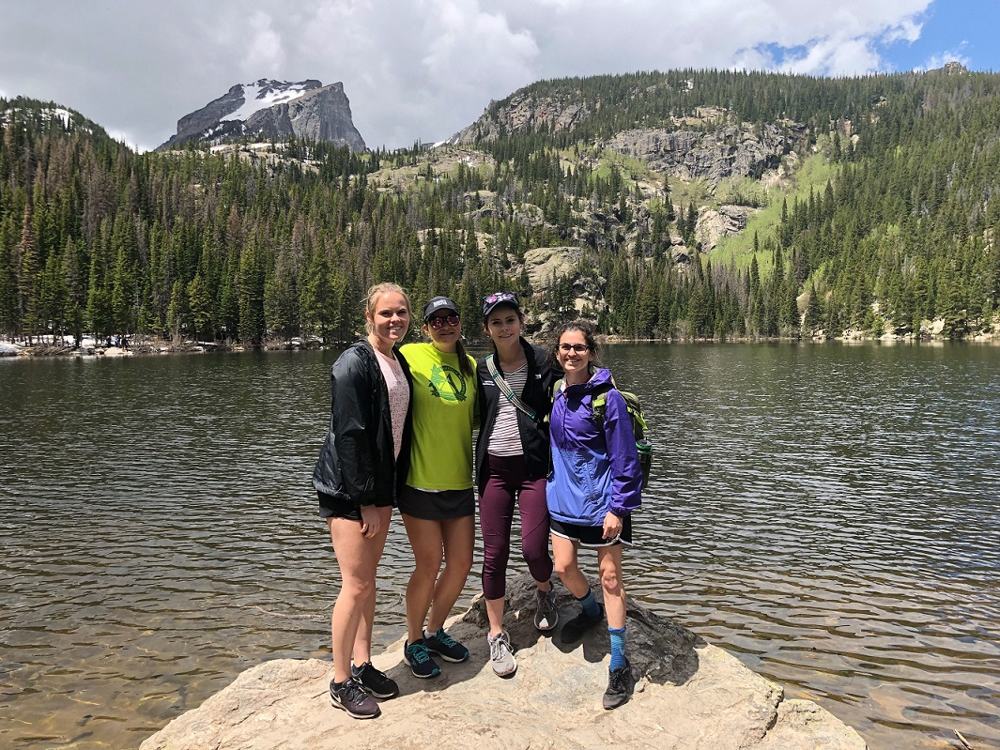

## Introduction
---
_Hi, I'm Jessie._  My pronouns are she/her and I'm starting my 3rd year in the [CS Theory](https://www.colorado.edu/cs-theory/) group.

This blog will be maintained for CSCI 5839 (User-Centered Design) at CU Boulder in Fall 2019.

