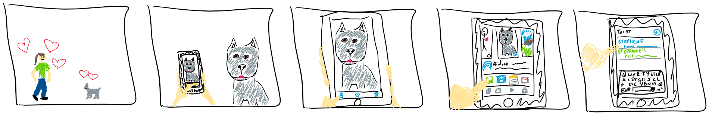

## Sketching and storyboarding
---

This week, we read some of _Sketching User Experiences: The Workbook_.  After, we were supposed to storyboard the workflow for how one would send a photo to a contact on their mobile phone.  Since I have an iPhone, I went with that interface.

Pardon my computer drawing and love of dogs.  (The latter has shown up on my FCQs before.)

