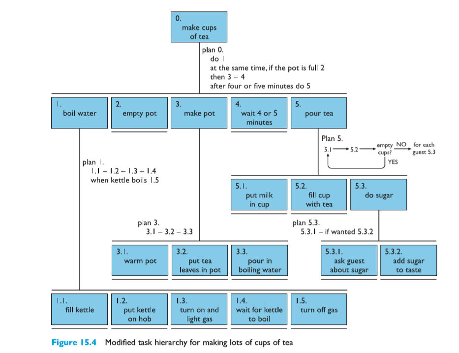
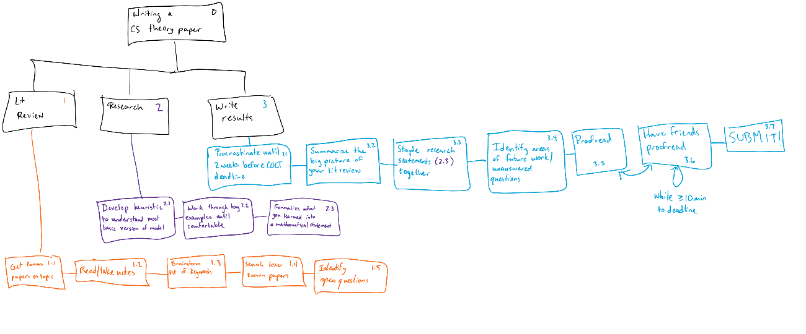

## Users and tasks
---

### Personas
Honestly, I shut down around page 6 of this reading, and it took me a while to stop steaming enough to be open to the author's insights again.  For context, designing with _personas_ is this idea of creating a user of a piece of software, very concretely, and designing with this user's specific needs in mind.

Throughout the reading, I kept writing questions in my notes about how personas disparately impact different groups of people.  AND THEN, on page 6, the author wrote about designing personas that play into stereotypes, so that programmers buy into the existence of such people.  In his example, he cites creating a persona of a female nurse, because women vastly outnumber men in the field.  The messaging on this is insane to me; if I was a woman of color on that programming team, and every persona of a programmer was a nerdy white guy who plays Dungeons and Dragons, I would feel like I didn't belong in that environment.  To me, it's super meta, too.  Did the author write this chapter with the persona of a straight white cis-male in mind?  It seems like he didn't even think about the messaging to underrepresented people in writing this.

With that being said, I think the concept of designing with personas in mind can be great _if care is taken to not disparately affect intended users that don't fit the stereotype._  If someone is outside the intended target audience, that's fine, but trying to generalize a product designed with one stereotypical user in mind can be dangerous.

For example, my frustration can be reflected in the [Gender Shades](http://gendershades.org/overview.html) project.  Researchers designed facial recognition systems that were primarily trained on white male faces, and when they claimed 99% accuracy, that was true... for white cis-men.  However, IIRC, women of color were only recognized with about 67% accuracy when these algorithms were audited.  Designing for Gary, the white carpenter who comes home with his hands full of tools that he has to bring to work doesn't always generalize to Alyssia, the Latina woman who wants a racial recognition doorbell when she comes home from school with her backpack and soccer bag in hands.

Here's a [Twitter post](https://twitter.com/jessie_fin/status/1170148339897094144?s=20), with some intriguing responses on my thoughts on stereotyping in personas.

### Task Analysis

In our second reading, Dix et al. describes a few techniques for decomposing a task into (ideally) uniquely identifiable parts by either breaking the task into subparts, creating a taxonomic hierarchy of subtasks, or creating a list of objects to be used and actions to be performed.
In task decomposition, the P x C rule seemed to say that we aim to design in a way such that our expected cost is below a certain threshold that we are willing to assume, if need be.

In general, it seems like there is a delicate balance in task decomposition between being too vague and too specific.  While in many cases, it seems more ideal to err on the end of over-specificity, trying to process and understand the task that is over-specified was overwhelming for me, as in their tea making example.

 

### Contextual Design

The HCI Handbook chapter on Contextual Design discusses studying users and planning as a team how to create and invent tools that are beneficial for the target audience.  I think it's funny that a common thread through these readings is "the user doesn't know what they want," but that sentiment is particularly highlighted in this passage.  In this section, they also discuss the value of prototyping and user testing- especially before making the jump to software prototyping.

I think most importantly for this section of the class, they also discuss different types of task modeling, summarized as follows:
* _Sequence Model:_ A representation of the activities of a user in the system, typically in chronological order.
* _Flow Model:_ Representing required coordination and effort between different groups in the system.
* _Cultural Model:_ Designed to reveal the influences exerted between people, groups in the organization, and the organization itself.
* _Physical Model:_ Shows the physical layout and constraints of the environment.
* _Artifact Model:_ Shows how objects are structured and used in the system.

### My task model

My research is in CS Theory, so task modeling is something new to me.  I figured I would write a task model on writing a CS theory paper, with a few satirical steps thrown in.  (ex: 3.1)

 
