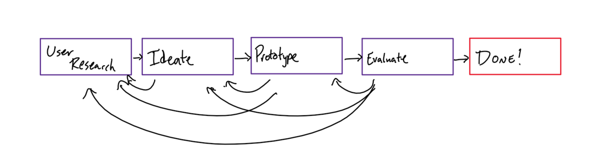
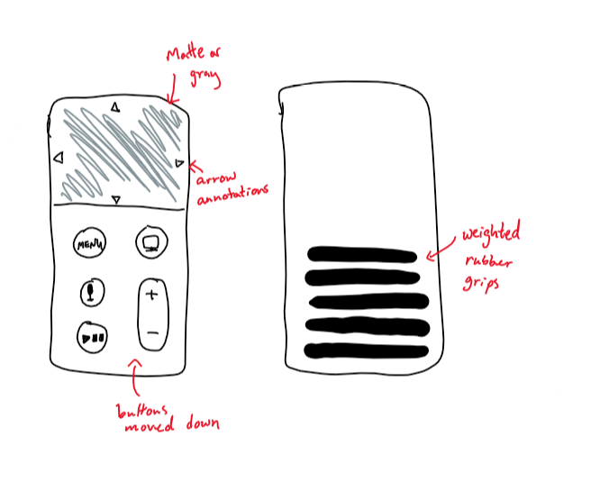

This week, I got to work with a handful of people, including (but not limited to... I didn't catch all the names) Vinitha, Lucas, Isabella, and Adam.

On Monday, we were able to discuss some examples of things that were designed well and things that were designed poorly, as well as how to talk about the aspects of good design.
Some of the themes in issues encountered included:
* Too many options (ex: the amount of buttons on a microwave)
* The amount and type of feedback given (ex: no tactile esc key on the new Macbook Pro)
* Some mismatch between intention and design.

Generally, people have goals, expectations, and limited resources when it comes to using and learning to use new technologies, so we have to learn these and  keep them in mind when designing new technologies.

On Wednesday, we focused on a redesign of the latest Apple TV remote.  We learned what a design charrette is, and my group (Vinitha, Isabella, and Adam) and I  got to dream up a redesign of the remote.  In the design charrette, we each took 3-4 minutes to brainstorm ideas on our own, took 5 minutes to discuss and synthesize our ideas, and another 5 to come up with a new, collaborative design.

